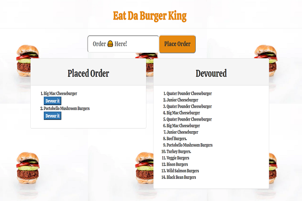

# burger

# Information

I created a burger logger with MySQL, Node, Express, Handlebars and a homemade ORM (yum!). I used Node and MySQL to query and route data in my app, and Handlebars to generate HTML for web browser layouts.

- Live Heroku Image Link Below :point_down:

    

- Database illustration image below :point_down:

    

# Technology 

- JavaScript

- jQuery

- node.js

- NPM (Node Package Manager)

- Bootstrap

- Heroku / JawsDB

- Handlebars

- CSS

- MySQL

- orm.js

# Description

- Eat-Da-Burger! is a restaurant app that lets users input the names of burgers they'd like to order and eat.

- Whenever a user submits a burger's name, the app will display the burger on the left side of the page (Placed Order)-- waiting     to be devoured.

- Each burger in the waiting area also has a `Devour it!` button. When the user clicks it, the burger will move to the right side    of the page (Devoured).

- The app will store every burger in a database, whether devoured or not and also keeps count of burgers Devoured as shown in the    Database illustration.

- Database name (Burgers_db) was replaced by (wuwyutnp5zrgpe1b) as shown in the database illustration above. This is because my      database connection info (Properties and values) was established through JawsDB Add-ons in Heroku. Generating its own Host         connection configuration for MySQL that can not be modify.