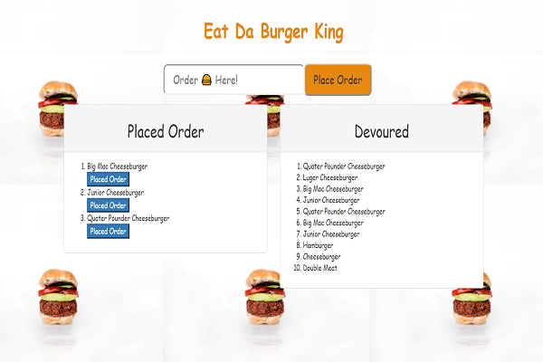
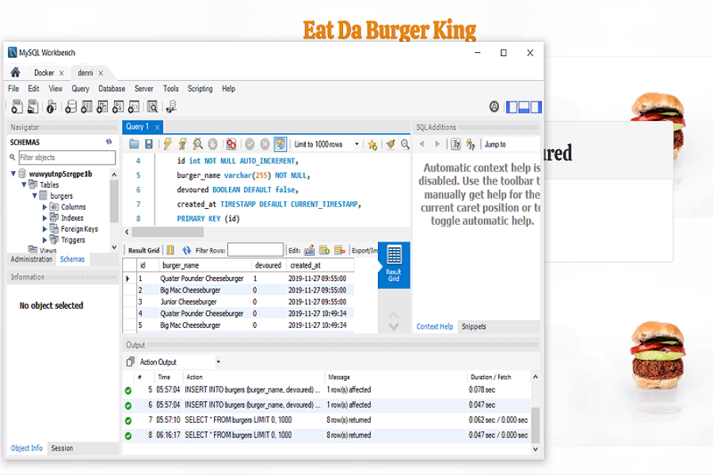

# burger

# Information

I created a burger logger with MySQL, Node, Express, Handlebars and a homemade ORM (yum!). I used Node and MySQL to query and route data in my app, and Handlebars to generate HTML for web browser layouts.

- Live Heroku Link

    

- Database illustration image

    

# Technology 

- JavaScript

- jQuery

- node.js

- NPM (Node Package Manager)

- Bootstrap

- Heroku

- Handlebars

- CSS

- mySQL

- orm.js

# Description

- Eat-Da-Burger! is a restaurant app that lets users input the names of burgers they'd like to eat.

- Whenever a user submits a burger's name, the app will display the burger on the left side of the page -- waiting to be devoured.

- Each burger in the waiting area also has a `Devour it!` button. When the user clicks it, the burger will move to the right side of the page.

* The app will store every burger in a database, whether devoured or not.